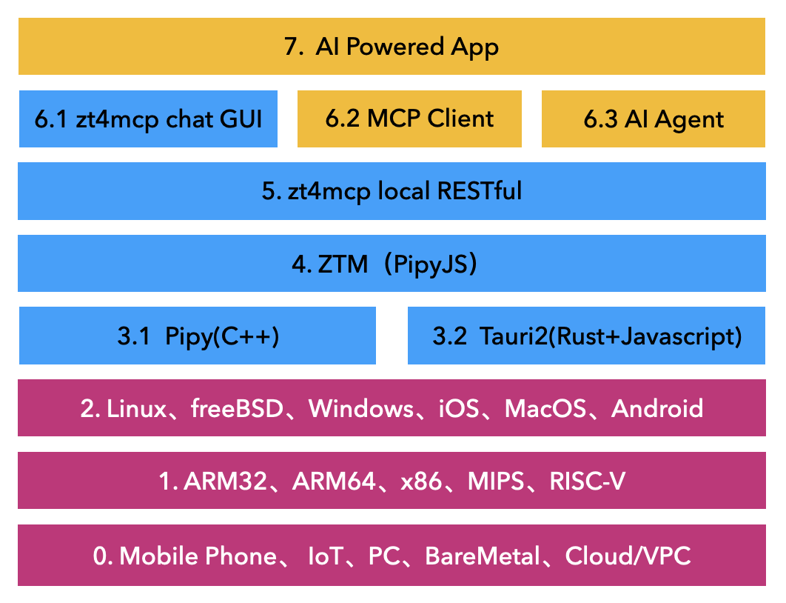
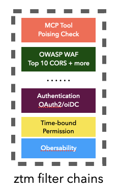

  

  
  
  
  
  
  
  

  
  
  
  
  

# zt4mcp (Zero Trust for MCP)

`zt4mcp` is ：
* An universal MCP Client capable of running on various devices and platforms, including PCs, mobile phones, IoT devices, servers, and cloud VPCs.
* A framework for rapid AI application development, with the built-in chat tool serving as a prime example.
* A simple and easy-to-use Zero Trust framework that provides an end-to-end secure AI runtime environment.

It is a framework for AI application developers and runtime, it provides a robust framework and a set of tools to ensure that every interaction within an MCP ecosystem is explicitly verified, access is granted on a least-privilege basis, and a breach is always assumed. It enable developers and organizations to confidently leverage the full power of MCP by:
* Enhancing Security Posture: Implementing granular access controls, strong authentication, and continuous authorization for all MCP clients, servers, and tools.
* Mitigating Risks: Protecting against known MCP vulnerabilities such as tool manipulation, unauthorized data access, and malicious command execution.
* Fostering Trustworthy AI: Building a safer environment for AI agents to operate, interact with data, and execute tasks.
* Promoting Secure Adoption: Providing a practical and accessible Zero Trust solution to encourage the secure development and deployment of MCP-enabled applications.

While zt4mcp provides powerful Zero Trust capabilities, it’s also very simple to setup and  easy to use with GUI, CLI and RESTful API.

## Why zt4mcp?

Traditional security models are often insufficient for the unique, dynamic, and trust-sensitive nature of MCP environments. Recognizing this critical gap, we are proud to introduce zt4mcp (Zero Trust for MCP) – an innovative open-source project dedicated to implementing a comprehensive Zero Trust security architecture specifically tailored for the Model Context Protocol.

### For developers

* 🔒 No Trust Assumed: Developers can build and test tools in isolated environments using mTLS and cert-based identity—reducing risk from untrusted networks or nodes.
* 🚀 Faster Iteration: Connect securely to remote MCP servers without VPNs, even behind NATs and firewalls. Ideal for local testing with real production models.
* 🧩 Tool Safety Built-In: Tool descriptions are semantically validated and vetted for integrity, preventing tool poisoning during development.
* 🔍 Deep Observability: Full audit logging, runtime traceability, and real-time debugging across distributed components.
* ⚙️ One Protocol to Rule All: Securely stream outputs from MCP tools over STDIO/SSE/WebSockets, fully integrated into IDEs.
* 🌐 Local Integration Made Easy: A built-in local RESTful API simplifies the development of AI apps and MCP Runners, enabling faster and more flexible prototyping.

### For AI powered application production usage 

* 🔐 End-to-End Zero Trust: Every agent-tool interaction is verified, scoped, and logged—ensuring safe execution even in adversarial settings.
* 🌍 Internet-Wide Reach: Painless NAT/firewall traversal allows agents to access MCP servers and tools anywhere in the world.
* 🧠 Guardrails for Agent Autonomy: Fine-grained, time-bound permissions prevent agents from overstepping their scope.
* 📦 Tool Tampering Prevention: Schema validation, behavior monitoring, and trusted repositories mitigate the risk of manipulated tools.
* 🔄 Dynamic & Compliant: Apps can adapt in real time, while maintaining auditability and policy enforcement across interactions.

### For Enterprise

* 🛡️ Defense-in-Depth Architecture: Leverages OWASP-guided controls and research-backed Zero Trust layers across all MCP components—client, server, and tool chain.
* 🧾 Audit and Compliance Ready: Every action is logged, traceable, and backed by TLS/mTLS—meeting enterprise regulatory demands.
* 🔐 Federated Identity & Access: Integrates with enterprise IAM (OAuth2/OIDC/LDAP) for seamless access control and SSO.
* 🎯 Least Privilege + Just-In-Time Access: Reduce breach impact with fine-grained, ephemeral permissions for each tool or user session.
* 🧠 Smart Threat Detection: Detects abnormal tool behaviors, impersonation attempts, and enforces protocol-level validation.

##  zt4mcp Stack Overview

The `zt4mcp` stack is a modular, cross-platform architecture designed for building AI-powered applications on top of a secure, extensible, and portable zero-trust mesh communication platform. Each layer in the stack builds upon the foundation of diverse hardware support, operating systems, and transport technologies.

### 📦 Stack Layers Breakdown

#### **0. Hardware & Deployment Platforms**
- **Supported Platforms:** Mobile Phone, IoT, PC, BareMetal, Cloud/VPC  
This layer ensures the stack can run in virtually any deployment environment, from embedded devices to large-scale cloud infrastructures.

#### **1. CPU Architectures**
- **Architectures:** ARM32, ARM64, x86, MIPS, RISC-V  
Support for a wide range of CPU architectures allows the stack to be hardware-agnostic.

#### **2. Operating Systems**
- **Supported OSes:** Linux, FreeBSD, Windows, iOS, macOS, Android  
Cross-OS compatibility enables development and deployment across all major desktop, server, and mobile environments.

#### **3. Runtime Engines**
- **3.1 Pipy (C++)**: A lightweight, high-performance edge engine optimized for service mesh and programmable networking.
- **3.2 Tauri2 (Rust + JavaScript)**: Used to build lightweight and secure native apps with web-based UIs.

#### **4. ZTM (PipyJS)**
- **Zero Trust Mesh (ZTM)**: Built using PipyJS, providing secure, programmable, and lightweight mesh networking.

#### **5. Local RESTful API**
- **zt4mcp Local RESTful API**: Exposes local control and configuration endpoints for interoperability with external systems.

#### **6. Interfaces**
- **6.1 zt4mcp Chat GUI**: A user-facing graphical interface for interacting with the stack.
- **6.2 MCP Client**: A management control protocol client for interfacing with MCP servers.
- **6.3 AI Agent**: Interfaces AI functionalities with the rest of the stack.

#### **7. AI-Powered Applications**
- **Top-Layer Apps**: Custom AI applications leveraging the stack’s secure communication and interface layers for advanced use cases.

## How zt4mcp Works

**zt4mcp** enables secure, decentralized communication between local developer tools or AI-powered applications and remote LLMs or MCP servers using the ZTM (Zero Trust Mesh) network.

### Overview

This architecture provides a secure mesh network using mTLS, allowing local tools and applications to interact with remote services like LLMs and MCP servers. The key elements in this system include `ztm agents`, `ztm hub`, and `ztm filter chains`, which work together to ensure authentication, encryption, access control, and threat protection.

### Step-by-Step Workflow

1. **Agent Installation**  
   Developers install a `ztm agent` (local gateway) on their machine, or AI-powered apps bundle it directly.

2. **Local Communication**  
   Applications or IDEs communicate with the local `ztm` gateway using HTTP (typically on `localhost:7777`).

3. **Mesh Network Communication**  
   The ZTM mesh uses mTLS for:
   - Authentication & Authorization  
   - Access Control  
   - Threat Detection  
   - Auditing  
   - Routing  
   - Network Encryption/Decryption  

4. **Server-Side Integration**  
   On the server side, the `ztm agent` relays traffic securely to LLMs or MCP servers via HTTPS or STDIO/SSE/WebSocket protocols.

### Security Filters (ztm filter chains)

Each agent can enforce a series of customizable filters, such as:

- **MCP Tool Posing Check**
- **OWASP WAF (Top 10, CORS, etc.)**
- **OAuth2/OIDC Authentication**
- **Time-Bound Permissions**
- **Observability**

These chains ensure security, compliance, and observability at both endpoints of communication.

## Features

* Local RESTful API for convenient and rapid development of MCP Runner and AI Agent
* Cross-platform runtime capability, write once and run anywhere
* Network traversal capability, enabling clients to penetrate firewalls and other intermediate network devices, thereby improving development efficiency and reducing management complexity
* mTLS-based network communication for enhanced security; identity authentication based on mTLS certificates
* Fine-grained access control with customizable security management policies

## Documentation

## Quick Start

### Download

### Setup

## Quick Links:
